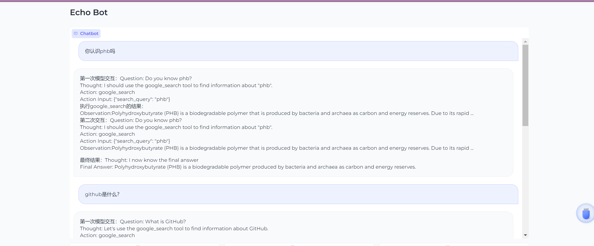

# TinyAgent（基本结构已经拥有了，优化中）

在`ChatGPT`横空出世，夺走`Bert`的桂冠之后，大模型愈发的火热，国内各种模型层出不穷，史称“百模大战”。大模型的能力是毋庸置疑的，但大模型在一些实时的问题上，或是某些专有领域的问题上，可能会显得有些力不从心。因此，我们需要一些工具来为大模型赋能，给大模型一个抓手，让大模型和现实世界发生的事情对齐颗粒度，这样我们就获得了一个更好的用的大模型。


一步一步手写`Agent`，可以让我们对`Agent`的构成和运作更加的了解。以下是`React`论文中一些小例子。

> 论文：***[ReAct: Synergizing Reasoning and Acting in Language Models](http://arxiv.org/abs/2210.03629)***


## 项目结构

```
tinyAgent
├─ build.ipynb
├─ components
│  ├─ Agent.py
│  ├─ LLM.py
│  └─ Tools.py
├─ README.md
├─ static
└─ test.ipynb

```
## 你需要的资源
```bash
Google Search key(https://serper.dev/dashboard)
OpenAI API KEY
```


## 实现细节

### Step 1: 构造大模型（LLM.py）

考虑到显卡资源有限，演示直接直接使用Langchain 的OpenAI API来构建LLM模块，当然你也可以选择加载本地的大模型。


首先构建一个BaseModel类，可以选择性传入一个path，表示你本地的LLM.

默认为空字符串，不传则代表使用API.

```python
from typing import Dict, List, Optional, Tuple, Union

import torch 
from transformers import AutoTokenizer, AutoModelForCausalLM
from langchain_openai import OpenAI,ChatOpenAI
from langchain_core.messages.ai import AIMessage
from langchain_core.messages.human import HumanMessage

class BaseModel:
    def __init__(self,path:str='') -> None:
        if path!='':
            self.tokenizer=AutoTokenizer.from_pretrained(path)
            self.model=AutoModelForCausalLM.from_pretrained(path)
        elif path=='':
            self.model= ChatOpenAI(model="gpt-3.5-turbo", temperature=0.1)
            
    
    def chat(self, prompt: str, history: List[dict]):
        pass

    def load_model(self):
        pass

```

构造一个子类OpenAIModel，这个类是我们使用API的类，继承于BaseModel。

如果你使用本地的大模型，需要自行构造子类。

```python
class OpenAIModel(BaseModel):
    def __init__(self, path: str = '') -> None:
        super().__init__(path)

    def chat(self,query:str, prompt_template: str='', history:List=[]):

        message=prompt_template+f'\n\n{query}'
        message=HumanMessage(content=message)

        res=self.model.invoke(message)
        return res
```


### Step 2: 构造方法类（Tools.py）

这里的话协议一个简单的谷歌搜索方法，有兴趣可以自行按照格式加

```python
import json 
import requests
import os 

class Tools:
    def __init__(self) -> None:
        self.tools_config=[
            {
                'chinese_name':'谷歌搜索',
                'english_name':'google_search',
                'description':'谷歌搜索是一个通用搜索引擎，可用于访问互联网、查询百科知识、了解时事新闻等。',
                'parameters':[
                    {
                        'name': 'search_query',
                        'description': '搜索关键词或短语',
                        'required': True,
                        'schema': {'type': 'string'},
                    }
                ]
            },
        ]
        self.api=os.getenv('google_search_api')

    
    def get_func(self):
        return self.tools_config
    
    def google_search(self,search_query:str):
        url = "https://google.serper.dev/search"

        payload = json.dumps({
        "q":search_query
        })
        headers = {
        'X-API-KEY': self.api,
        'Content-Type': 'application/json'
        }

        response = requests.request("POST", url, headers=headers, data=payload).json()
        return  response['organic'][0]['snippet']


```


### Step 3: 构造Agent类（Agent.py）

agent类定义了prompt——template,可以自己改喔
基于模型回答选择方法function
调用function，将结果再次给到大模型。
实际上就是进行两次大模型交互。

```python
from typing import Dict, List, Optional, Tuple, Union
import json5

from components.LLM import OpenAIModel
from components.Tools import Tools


TOOL_DESC = """{english_name}: Call this tool to interact with the {chinese_name} API. What is the {chinese_name} API useful for? {description} Parameters: {parameters} Format the arguments as a JSON object."""

REACT_PROMPT = """Answer the following questions as best you can. You have access to the following tools:

{tools_description}

Use the following format:

Question: the input question you must answer
Thought: you should always think about what to do
Action: the action to take, should be one of [{tools_name}]
Action Input: the input to the action
Observation: the result of the action
... (this Thought/Action/Action Input/Observation can be repeated zero or more times)
Thought: I now know the final answer
Final Answer: the final answer to the original input question

Begin!


"""

class Agent:
    def __init__(self,path:str='') -> None:
        self.path=path
        self.tools=Tools()
        self.tools_config=self.tools.get_func()
        self.llm=OpenAIModel()
        self.template_prompt=self.build_template_prompt()

    def build_template_prompt(self):
        tools_description,tools_name=[],[]

        for tool in self.tools_config:
            tools_description.append(TOOL_DESC.format(**tool))
            tools_name.append(tool['english_name'])
        tools_description = '\n\n'.join(tools_description)
        tools_name = ','.join(tools_name)
            
        template_prompt=REACT_PROMPT.format(tools_description=tools_description,tools_name=tools_name)

        return template_prompt
    
    def select_func_call(self,text:str):
        func_name=''
        func_args=''
        i = text.rfind('\nAction:')
        j = text.rfind('\nAction Input:')
        k = text.rfind('\nObservation:')
        if j>i>=0:
            if k<0:
                text.strip()+'\nObservation:'
            k = text.rfind('\nObservation:')
            func_name=text[i+len('\nAction:'):j].strip()
            func_args=text[j+len('\nAction Input:'):k].strip()
            text=text[:k].strip()

        return func_name,func_args,text
    
    def call_plugin(self, func_name, func_args):
        
        func_args = json5.loads(func_args)

        if func_name=="google_search":

            return '\nObservation:' + self.tools.google_search(**func_args)
            
        
    def chat_by_func(self,text,history=[]):
        res_model_1=self.llm.chat(text,self.template_prompt)
        func_name,func_args,text=self.select_func_call(res_model_1)
        if func_name:
            res_func=self.call_plugin(func_name, func_args)
            res_model_2=text+res_func
        result=self.llm.chat(res_model_2,self.template_prompt)
        return result

```


### Step 4：Agent,启动！

 这里基于gradio的界面启用演示

```python
import gradio as gr
import time
from components.Agent import Agent


agent=Agent()


def echo(message, history):
    # result=agent.llm.chat(message,agent.template_prompt)
    result=agent.chat_by_func(message)
    
    for i in range(len(result)):
        time.sleep(0.02)
        yield result[: i+1]

        #自定义的流式输出


demo = gr.ChatInterface(fn=echo, 
                        examples=["特朗普什么时候出生？","github是什么？"], 
                        title="Echo Bot",
                        theme="soft")
demo.launch()
```

## result


## 论文参考

- [ReAct: Synergizing Reasoning and Acting in Language Models](http://arxiv.org/abs/2210.03629)